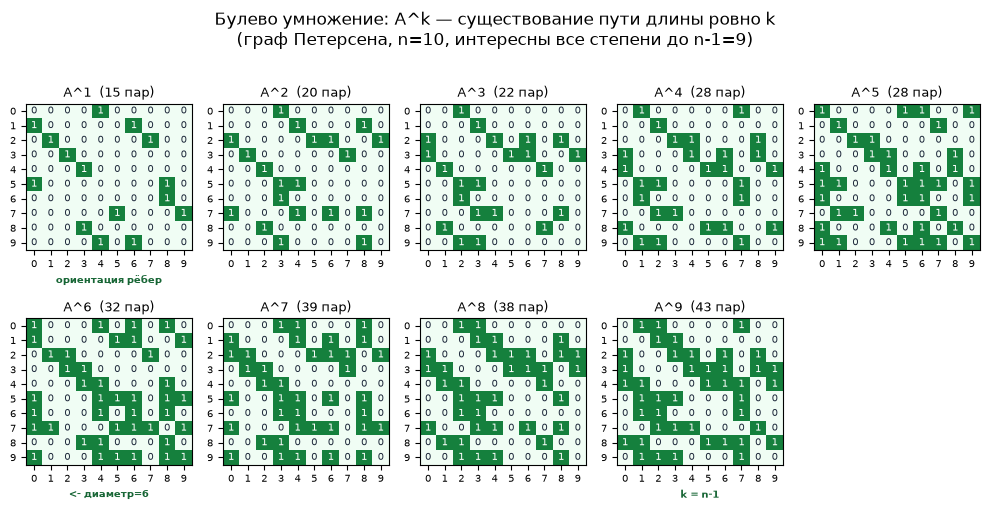
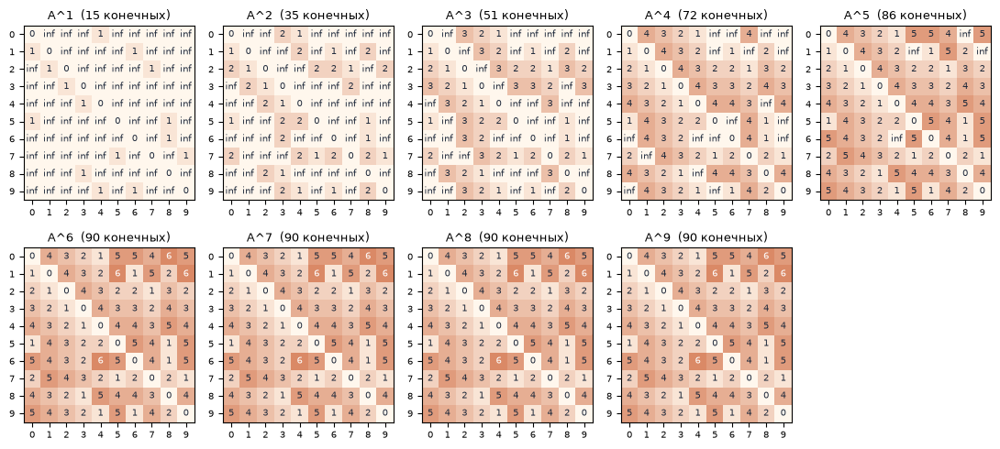
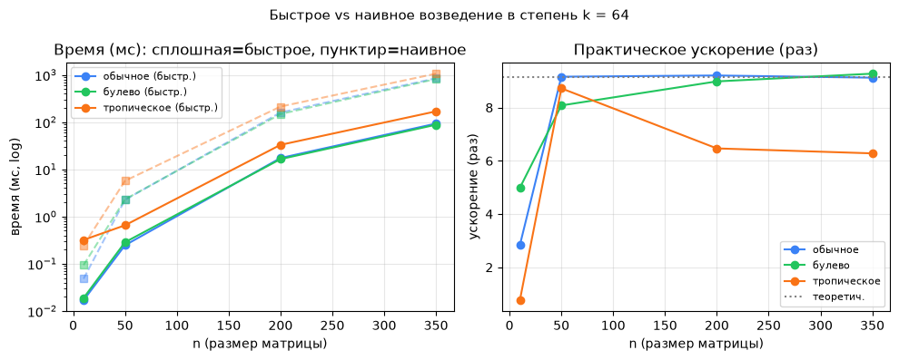
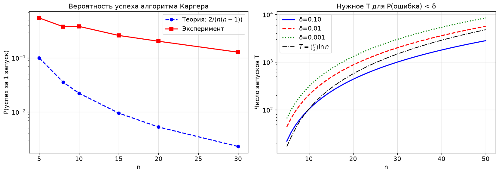
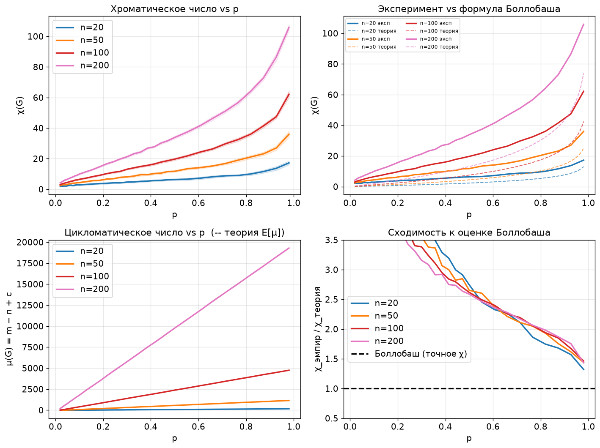
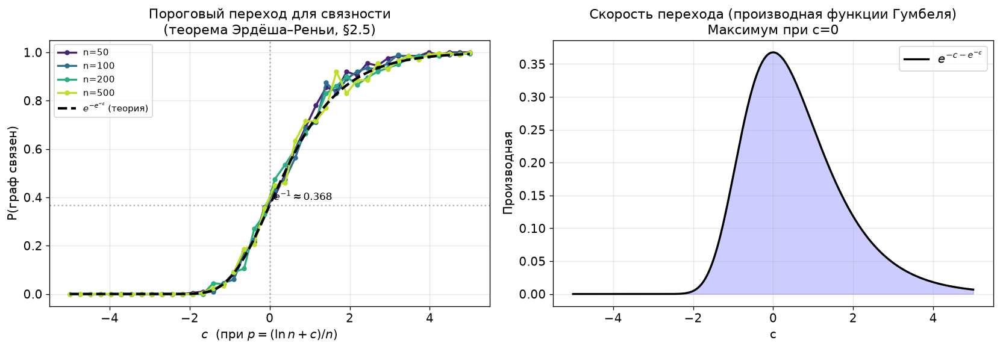
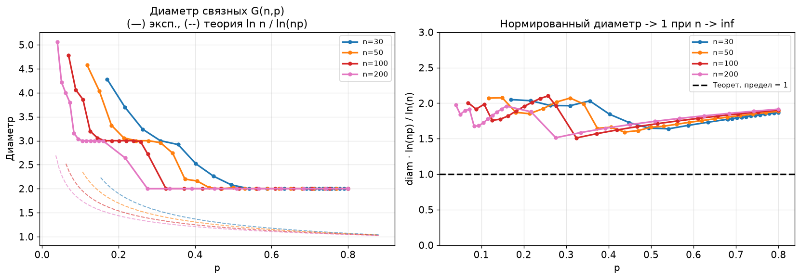

# graph-experiments

Эксперименты по теории графов: степени матрицы смежности в трёх арифметиках, алгоритм Каргера, хроматическое и цикломатическое число, порог связности и диаметр случайных графов $G(n,p)$.

[](https://colab.research.google.com/github/yoonzky/graph-experiments/blob/main/matrix_powers.ipynb)
[](https://colab.research.google.com/github/yoonzky/graph-experiments/blob/main/random_graphs.ipynb)

## matrix_powers.ipynb

Степени $A^k$ матрицы смежности ориентированного графа при трёх видах умножения:

| Умножение | Операции | Единичная матрица | $A^k[i][j]$ |
| --- | --- | --- | --- |
| Обычное | $+$, $\times$ | 1 на диагонали, 0 вне | число маршрутов длины ровно k |
| Булево | OR, AND | 1 на диагонали, 0 вне | 1, если есть маршрут длины ровно k |
| Тропическое | min, $+$ | 0 на диагонали, $\infty$ вне | длина кратчайшего пути не более чем из k рёбер |

- Умножение написано дважды: циклами по спискам и на NumPy, тропическое через broadcasting. Обе версии сверяются на случайных матрицах.
- Возведение в степень наивное (k умножений) и бинарное: $\lfloor \log_2 k \rfloor$ возведений в квадрат плюс по умножению на каждую единицу в двоичной записи k.
- Пример — граф Петерсена со случайной ориентацией рёбер (seed=5): сильносвязный, диаметр 6. Накопленный OR $A^1 \vee \dots \vee A^9$ сверяется с алгоритмом Уоршелла, матрица расстояний из тропических степеней — с NetworkX.
- Перебор всех $2^{15} = 32768$ ориентаций графа Петерсена: сильносвязны 1920, диаметр 6 у 480 из них, 7 у 720, 8 у 480, 9 у 240.





Замер при k = 64 на случайных графах с p = 0,3, Apple M4: быстрое возведение делает 7 умножений вместо 64.

| n | Обычное | Булево | Тропическое |
| --- | --- | --- | --- |
| 50 | 9,2× | 8,1× | 8,7× |
| 200 | 9,2× | 9,0× | 6,5× |
| 350 | 9,1× | 9,3× | 6,3× |



## random_graphs.ipynb

### Алгоритм Каргера

Случайное стягивание рёбер через систему непересекающихся множеств, точный минимальный разрез $\lambda$ — алгоритмом Штёра — Вагнера. Нижняя оценка успеха одного запуска $2/(n(n-1))$.

| n | Нижняя граница | P(успех) на $G(n, 0.5)$ | Отношение |
| --- | --- | --- | --- |
| 5 | 0,100 | 0,549 | 5,5 |
| 10 | 0,022 | 0,383 | 17,2 |
| 20 | 0,0053 | 0,203 | 38,6 |
| 30 | 0,0023 | 0,128 | 55,5 |

- Номер первого успеха распределён геометрически: на $G(15, 0.5)$ $p_{emp} = 0.213$, для 99 % хватает 20 запусков, нижняя граница требует 482.
- При n = 20 вероятность падает с ростом разреза: 0,71 при $\lambda \approx 1$ (p = 0,1), 0,11 при $\lambda \approx 14$ (p = 0,9).
- Два полных графа, соединённых мостом ($\lambda = 1$): 0,75 при n = 30 против 0,14 у $G(30, 0.5)$.



### Хроматическое и цикломатическое число

- $\chi$ оценивается жадной раскраской (largest_first) и сравнивается с теоремой Боллобаша $\chi(G(n,p)) \sim n \ln\frac{1}{1-p} / (2 \ln n)$. При p = 0,5 жадная оценка выше формулы в 2,74 раза для n = 20 и в 2,59 для n = 200.
- $\mu = m - n + c$ совпадает с $\binom{n}{2}p - n + 1$ в пределах 1,5 % при p = 0,1 и 0,5; ниже порога связности формула неприменима. Первые циклы появляются около p = 1/n.



### Связность и диаметр

- Доля связных графов при $p = (\ln n + c)/n$ для n от 50 до 500 совпадает с пределом $e^{-e^{-c}}$ (Эрдёш — Реньи), по 200 графов на точку.
- Диаметр связных графов при n ≤ 200 в 1,5–2,1 раза больше асимптотики $\ln n / \ln(np)$, плотные графы имеют диаметр 2.
- При n = 500 и p = c/n диаметр убывает от 8,2 (c = 5) до 3 (c = 50).






## Запуск

```
pip install -r requirements.txt
jupyter notebook matrix_powers.ipynb
```

## Стек

Python, NumPy, NetworkX, Matplotlib.

Теоремы о случайных графах — по книге А. М. Райгородского «Модели случайных графов».

Лекционные задания курса «Комбинаторика и теория графов», СПбГЭТУ «ЛЭТИ», 2026.
